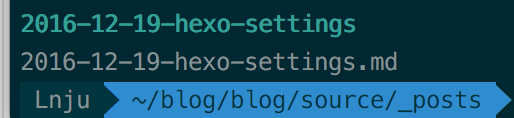

title: hexo-settings
layout: post
date: 2016-12-19 04:54:34
categories: 博客
tags: hexo
---

# 1. 如何把图片和md放在一块？

-  为什么这么干？

   网上的一般做法是把图片保存下来，然后上传到七牛云存储上，直接在md中引用图片的链接就好了，这样做的好处是，七牛云存储加载起来会比较快吧。但是同时也带来一个弊端，每次上传好图片后，本地的图片就不会再管理了，万一哪天七牛收费了，再搬运图片也很麻烦。再说把图片和文本打包在一块也方便在几个电脑上一起同步，另外，反正我的博客也没几个人会关注到，慢一点也无所谓了啦。

-  怎么做？

   修改 **_config.yml**文件，把开关打开。

   ```cpp
   post_asset_folder: false -> true
   ```

   在用hexo new 新建文章的时候，就会在md同目录下生成一个和文章同名的文件夹，如图：

   

   把图片放进去，用的时候直接用相对路径写就可以了。

   ```
   
   ```

   ​